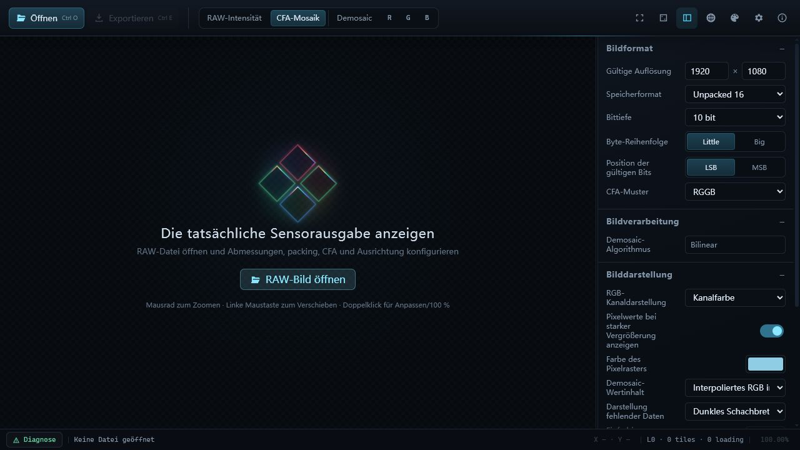

<p align="center">
  
</p>

<h1 align="center">eRAW</h1>

<p align="center">RAW-Bildbetrachter, Diagnosewerkzeug und Formatkonverter für die Inbetriebnahme von SoCs und Bildsensoren.</p>

<p align="center">
  <a href="https://github.com/woooooooooolf/eRAW/actions/workflows/ci.yml"></a>
  <a href="LICENSE"></a>
  
  <a href="https://tauri.app/"></a>
</p>

<p align="center">
  <a href="README.md">简体中文</a> · <a href="README.en.md">English</a> · <a href="README.zh-TW.md">繁體中文</a> · <a href="README.ja.md">日本語</a> · <a href="README.es.md">Español</a> · <a href="README.fr.md">Français</a> · Deutsch
</p>

## Screenshots



## Download

Die neueste Windows-x64-Version und die zugehörigen Hinweise finden Sie unter [GitHub Releases](https://github.com/woooooooooolf/eRAW/releases/latest).

## Hauptfunktionen

- Liest RAW8, RAW9–RAW16 in 16-Bit-Containern sowie MIPI RAW10/12/14.
- Unterstützt Mono, vier Bayer-Muster und vier Quad-CFA-Muster.
- Konfigurierbare aktive Größe, Datei-Header-Offset, Zeilen-/Frame-Stride und Ausrichtung mit Navigation durch mehrere Frames.
- Ansichten für RAW-Intensität, CFA, Remosaic, Demosaic und einzelne R/G/B-Kanäle.
- Hierarchisches Kachel-Rendering, LOD und GPU-Kachelcache für große Bilder.
- Zoom, Verschieben, Pixelprüfung, Erkennung des ursprünglichen CFA-Kanals und DN-Anzeige.
- Neun Oberflächenthemen und sieben Sprachen, die zur Laufzeit gewechselt werden können.

## Formate und Anzeige

| Kategorie | Aktuelle Unterstützung |
| --- | --- |
| Speicherung | Unpacked 8, Unpacked 16, MIPI RAW10, MIPI RAW12, MIPI RAW14 |
| Bittiefe | RAW8–RAW16; bei MIPI wird sie durch den Speichermodus bestimmt |
| CFA | Mono, RGGB, BGGR, GBRG, GRBG und die vier entsprechenden Quad-CFA-Muster |
| Byte-Layout | Little/Big Endian, gültige LSB/MSB-Bits, Header-Offset, Zeilen-/Frame-Stride und Ausrichtung |
| Verarbeitung | Quad-CFA-Neuanordnung, bilineare Rekonstruktion gleicher Farben, bilineares Demosaic |
| Prüfung | Navigation durch mehrere Frames, Zoom/Verschieben, Pixelraster, Koordinaten, CFA-Kanal und DN |

Die Anzeige toleriert nach Möglichkeit abgeschnittene oder unvollständige Eingaben und meldet Diagnosen ausdrücklich. Der Export prüft streng, um unvollständige oder mehrdeutige Ausgaben zu vermeiden.

## Export und Aufnahme

- Konvertiert und exportiert ursprüngliche CFA-Daten einschließlich Zuschnitt, Entfernung von padding, packed/unpacked- und Byte-Reihenfolge-Konvertierung.
- Exportiert den aktuellen Frame als Remosaic-Bayer- oder RGB48-Interleaved-Daten.
- Speichert das Canvas-Fenster oder die vollständige Vorschau als PNG oder kopiert sie in die Zwischenablage.

## Plattform und Technik

eRAW zielt derzeit vorrangig auf Windows und wird mit Tauri 2 erstellt:

- Frontend: TypeScript, WebGL2, Canvas 2D, natives HTML/CSS
- Backend: Rust, schreibgeschütztes Memory Mapping, binäres Tauri IPC
- Laufzeitabhängigkeit: Windows WebView2 Runtime

## Aus dem Quellcode starten

Erforderlich sind Node.js, stabiles Rust, Windows WebView2 und die von Tauri 2 benötigten Systemabhängigkeiten.

```powershell
npm.cmd install
npm.cmd run tauri dev
```

## Prüfung, Tests und Build

```powershell
npm.cmd run check
npm.cmd run test:frontend
npm.cmd run build
cargo test --manifest-path src-tauri/Cargo.toml
npm.cmd run release
```

`npm.cmd run release` verwendet die Tauri CLI und erzeugt eine Windows-Release-EXE mit eingebetteten Frontend-Ressourcen. Ersetzen Sie diesen Befehl nicht durch ein bloßes `cargo build --release`, da dadurch Frontend-Build und Ressourceneinbettung entfallen.

## Technische Dokumentation

Im [Index der technischen Dokumentation](docs/README.md) finden Sie Produktentscheidungen, Architektur, RAW-Semantik, Rendering, Tests und den Entwicklungsablauf.

## Aktueller Umfang

- eRAW dient der Diagnose roher Sensordaten; Fotoverbesserungen wie Rauschreduzierung, Schärfung, Farbkorrektur oder Reparatur defekter Pixel werden nicht durchgeführt.
- Demosaic verwendet derzeit einen bilinearen Algorithmus.
- Rechteckige ROI-Auswahl, Koordinateneingabe und Bereichsstatistiken über rohe L0-CFA-DN werden unterstützt.
- Es gibt keinen allgemeinen Stapelverarbeitungsablauf.

## Wartung und Beiträge

Das Projekt priorisiert Stabilität, Fehlerbehebungen und die Vollständigkeit bestehender Abläufe. Reproduzierbare Fehler, Kompatibilität, Dokumentation, Tests und klar begrenzte Optimierungen ohne Änderung der bestehenden Semantik sind willkommen. Funktionen, die Architektur, Verarbeitung oder Nutzerverhalten wesentlich verändern, haben in der Regel keine Priorität; zunächst sollten Problemgrenze und langfristiger Wartungsaufwand erläutert werden.

Umfang und Ablauf beschreibt [CONTRIBUTING.md](CONTRIBUTING.md); Sicherheitslücken werden gemäß [SECURITY.md](SECURITY.md) gemeldet.

## Lizenz

eRAW wird unter der [GNU General Public License v3.0 or later](LICENSE) veröffentlicht.
