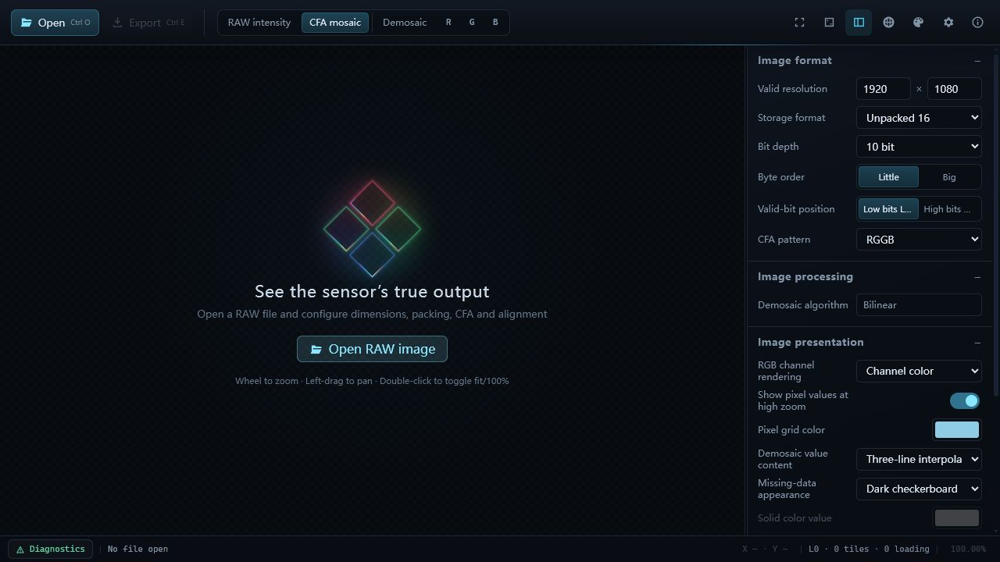

<p align="center">
  
</p>

<h1 align="center">eRAW</h1>

<p align="center">A RAW image viewer, diagnostic tool, and format converter for SoC and image-sensor bring-up.</p>

<p align="center">
  <a href="https://github.com/woooooooooolf/eRAW/actions/workflows/ci.yml"></a>
  <a href="LICENSE"></a>
  
  <a href="https://tauri.app/"></a>
</p>

<p align="center">
  <a href="README.md">简体中文</a> · English · <a href="README.zh-TW.md">繁體中文</a> · <a href="README.ja.md">日本語</a> · <a href="README.es.md">Español</a> · <a href="README.fr.md">Français</a> · <a href="README.de.md">Deutsch</a>
</p>

## Screenshots



## Download

Download the latest Windows x64 build and read its release notes from [GitHub Releases](https://github.com/woooooooooolf/eRAW/releases/latest).

Release EXEs are not Authenticode-signed, so Windows may show a SmartScreen warning. Download only from the Latest Release and verify files against the provided SHA-256 manifest.

## Highlights

- Reads RAW8, RAW9–RAW16 in 16-bit containers, and MIPI RAW10/12/14.
- Supports Mono, four Bayer patterns, and four Quad CFA patterns.
- Configurable active size, file-header offset, row/frame stride and alignment, with multi-frame navigation.
- RAW intensity, CFA, Remosaic, Demosaic, and individual R/G/B channel views.
- Hierarchical tiled rendering, LOD, and a GPU tile cache for large images.
- Zooming, panning, pixel inspection, raw CFA channel identification, and DN readout.
- Nine UI themes and seven interface languages, switchable at runtime.

## Formats and display

| Category | Current support |
| --- | --- |
| Storage | Unpacked 8, Unpacked 16, MIPI RAW10, MIPI RAW12, MIPI RAW14 |
| Bit depth | RAW8–RAW16; MIPI bit depth is determined by the storage mode |
| CFA | Mono, RGGB, BGGR, GBRG, GRBG, and the four matching Quad CFA patterns |
| Byte layout | Little/Big Endian, LSB/MSB valid bits, header offset, row/frame stride and alignment |
| Processing | Quad CFA rearrangement, same-color bilinear reconstruction, bilinear Demosaic |
| Inspection | Multi-frame navigation, zoom/pan, pixel grid, coordinates, CFA channel, and DN |

The viewer path tolerates truncated or incomplete input where possible and reports diagnostics explicitly. Export uses strict validation to prevent incomplete or ambiguous output.

## Export and capture

- Convert and export original CFA data, including cropping, padding removal, packed/unpacked conversion, and byte-order conversion.
- Export the current frame as Remosaic Bayer or RGB48 Interleaved data.
- Save the canvas window or the complete preview as PNG, or copy either to the clipboard.

## Platform and stack

eRAW currently targets Windows first and is built with Tauri 2:

- Frontend: TypeScript, WebGL2, Canvas 2D, native HTML/CSS
- Backend: Rust, read-only memory mapping, binary Tauri IPC
- Runtime dependency: Windows WebView2 Runtime

## Run from source

Install Node.js, stable Rust, Windows WebView2, and the system dependencies required by Tauri 2.

```powershell
npm.cmd install
npm.cmd run tauri dev
```

## Check, test, and build

```powershell
npm.cmd run check
npm.cmd run test:frontend
npm.cmd run build
cargo test --manifest-path src-tauri/Cargo.toml
npm.cmd run release
```

`npm.cmd run release` uses the Tauri CLI to produce a Windows Release EXE with the frontend assets embedded. Do not replace it with a bare `cargo build --release`, which skips the frontend build and resource-embedding pipeline.

## Engineering documentation

See the [engineering documentation index](docs/README.md) for product decisions, architecture, RAW semantics, rendering, testing, and the development workflow.

## Current scope

- eRAW diagnoses raw sensor data; it does not perform photo enhancement such as denoising, sharpening, color correction, or bad-pixel repair.
- Demosaic currently uses a bilinear algorithm.
- Rectangular ROI selection, coordinate entry, and region statistics over L0 raw CFA DN are supported.
- There is no general-purpose batch-processing workflow.

## Maintenance and contributions

The project currently prioritizes stability, defect fixes, and completeness of existing workflows. Reproducible defects, compatibility work, documentation and test improvements, and narrowly scoped optimizations that preserve existing semantics are welcome. Features that materially change the architecture, processing flow, or user behavior are generally not prioritized; proposals should explain the problem boundary and long-term maintenance cost first.

See [CONTRIBUTING.md](CONTRIBUTING.md) for scope and workflow. Follow [SECURITY.md](SECURITY.md) for vulnerability reports.

## License

eRAW is released under the [GNU General Public License v3.0 or later](LICENSE).
