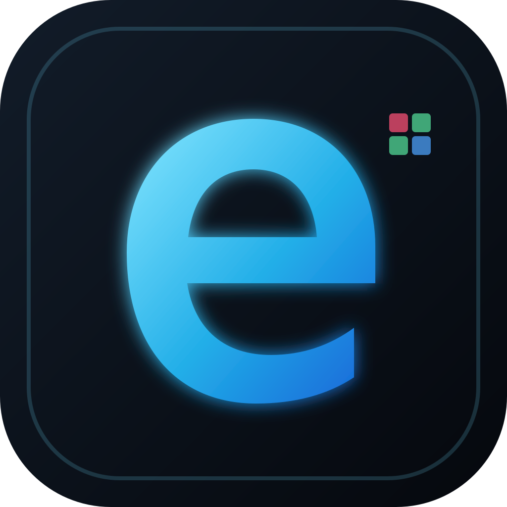
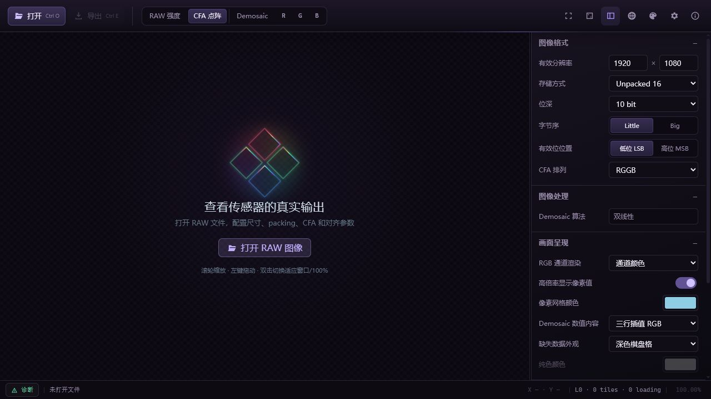
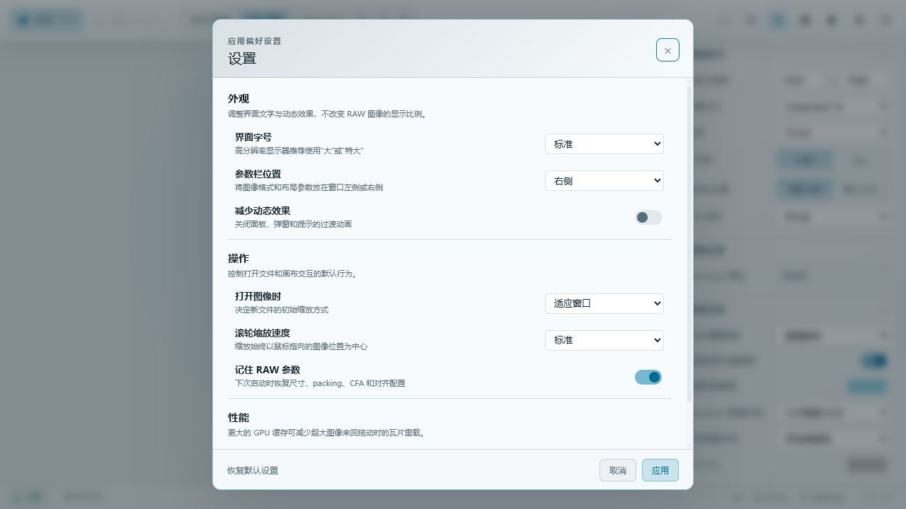

<p align="center">
  
</p>

<h1 align="center">eRAW</h1>

<p align="center">SoC およびイメージセンサーの立ち上げに向けた RAW 画像ビューアー、診断、形式変換ツール。</p>

<p align="center">
  <a href="https://github.com/woooooooooolf/eRAW/actions/workflows/ci.yml"></a>
  <a href="LICENSE"></a>
  
  <a href="https://tauri.app/"></a>
</p>

<p align="center">
  <a href="README.md">简体中文</a> · <a href="README.en.md">English</a> · <a href="README.zh-TW.md">繁體中文</a> · 日本語 · <a href="README.es.md">Español</a> · <a href="README.fr.md">Français</a> · <a href="README.de.md">Deutsch</a>
</p>

## スクリーンショット





## 主な機能

- RAW8、16-bit コンテナの RAW9–RAW16、および MIPI RAW10/12/14 に対応。
- Mono、4 種類の Bayer 配列、4 種類の Quad CFA 配列に対応。
- 有効サイズ、ファイルヘッダーオフセット、行/フレームのストライドとアラインメントを設定でき、複数フレームを閲覧可能。
- RAW 強度、CFA、Remosaic、Demosaic、R/G/B 単一チャンネル表示。
- 階層タイル、LOD、GPU タイルキャッシュによる大画像の表示。
- ズーム、パン、ピクセル位置、元の CFA チャンネル、DN 値の確認。
- 実行中に切り替え可能な 9 種類の UI テーマと 7 言語。

## 形式と表示

| 項目 | 現在の対応範囲 |
| --- | --- |
| ストレージ | Unpacked 8、Unpacked 16、MIPI RAW10、MIPI RAW12、MIPI RAW14 |
| ビット深度 | RAW8–RAW16。MIPI のビット深度はストレージ形式で決定 |
| CFA | Mono、RGGB、BGGR、GBRG、GRBG、および対応する 4 種類の Quad CFA |
| バイト配置 | Little/Big Endian、LSB/MSB 有効ビット、ヘッダーオフセット、行/フレームのストライドとアラインメント |
| 画像処理 | Quad CFA の再配列、同色双線形再構成、双線形 Demosaic |
| 検査 | 複数フレーム移動、ズーム/パン、ピクセルグリッド、座標、CFA チャンネル、DN |

表示処理は、可能な範囲で切り詰められたデータや不完全な入力を許容し、診断情報を明示します。エクスポート処理は厳密に検証し、不完全または曖昧な出力を防ぎます。

## エクスポートとキャプチャ

- クロップ、padding 除去、packed/unpacked 変換、バイト順変換を含む元の CFA データの変換とエクスポート。
- 現在のフレームを Remosaic Bayer または RGB48 Interleaved データとしてエクスポート。
- キャンバスウィンドウまたは完全なプレビューを PNG に保存、もしくはクリップボードへコピー。

## プラットフォームと技術スタック

eRAW は現在 Windows を主要ターゲットとし、Tauri 2 で構築されています。

- フロントエンド：TypeScript、WebGL2、Canvas 2D、ネイティブ HTML/CSS
- バックエンド：Rust、読み取り専用メモリマッピング、バイナリ Tauri IPC
- 実行時依存：Windows WebView2 Runtime

## ソースから実行

Node.js、安定版 Rust、Windows WebView2、および Tauri 2 が必要とするシステムビルド依存関係を準備してください。

```powershell
npm.cmd install
npm.cmd run tauri dev
```

## 検査、テスト、ビルド

```powershell
npm.cmd run check
npm.cmd run test:frontend
npm.cmd run build
cargo test --manifest-path src-tauri/Cargo.toml
npm.cmd run release
```

`npm.cmd run release` は Tauri CLI を使用し、フロントエンド資産を組み込んだ Windows Release EXE を生成します。単独の `cargo build --release` ではフロントエンドのビルドと資産の埋め込みが行われないため、公開用コマンドの代わりには使用しないでください。

## 技術文書

製品上の判断、システム構成、RAW の意味論、レンダリング、テスト、開発フローについては、[技術文書の索引](docs/README.md)を参照してください。

## 現在の範囲

- eRAW はセンサーの生データを診断するツールです。ノイズ除去、シャープ化、色補正、欠陥画素補正などの写真品質向上は行いません。
- 現在の Demosaic アルゴリズムは双線形です。
- 矩形領域選択モデルは用意されていますが、領域統計にはまだ接続されていません。
- 汎用的なバッチ処理フローはありません。

## ライセンス

eRAW は [GNU General Public License v3.0 or later](LICENSE) の下で公開されています。
