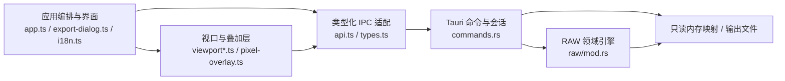

# 系统架构

## 总体分层



前端负责交互、可见瓦片调度和 GPU 合成；Rust 负责文件会话、格式计算、像素读取、处理算法和确定性导出。IPC 只传递结构化请求、文档信息和二进制结果，不传递整幅 RAW 副本。

Tauri capability 采用最小授权：主窗口除默认只读窗口能力外，仅额外开放原生全屏切换；F11 直接调用窗口 API，不通过 CSS 模拟或新增 Rust 命令。

## 模块职责

| 模块 | 主要职责 |
| --- | --- |
| `src/app.ts` | 应用状态、参数提交、菜单、状态栏、诊断、设置与对话框编排 |
| `src/descriptor-input.ts` | 数值参数的整数化、边界限制和空值默认规则 |
| `src/export-dialog.ts` | 冻结导出快照、范围联动、字段校验和导出反馈 |
| `src/i18n.ts` | 语言偏好、系统语言解析、七语文案目录、日期时间格式化和静态 DOM 翻译 |
| `src/backend-error.ts` | 解析后端结构化错误码，并在当前语言下生成用户消息 |
| `src/viewport.ts` | WebGL2、LOD、瓦片队列、纹理缓存、缩放和平移 |
| `src/viewport-transform.ts` | 屏幕、图像和像素坐标的唯一变换来源；选区模型 |
| `src/viewport-overlay.ts` | 图像边界与矩形选区 SVG 叠加 |
| `src/pixel-overlay.ts` | 高倍率像素网格与 DN/RGB 数字叠加 |
| `src/api.ts` / `src/types.ts` | Tauri 调用封装及前后端共享数据契约 |
| `src-tauri/src/commands.rs` | 当前文档会话、内存映射、缓存、任务快照和命令边界 |
| `src-tauri/src/raw/mod.rs` | 布局、packing、CFA、预览、Remosaic、Demosaic、检查与导出 |

`raw/mod.rs` 是无 UI 的领域核心。新格式和算法应优先在这里形成可测试的纯逻辑；`app.ts` 不应承担像素语义。

## 国际化与错误契约

- 设置只保存语言偏好；`system` 会按 BCP 47 语言族解析系统首选语言，不支持的语言回退英文。
- `i18n.ts` 的目录以英文、简体中文、繁体中文、日语、西班牙语、法语和德语形成完整类型约束。模板中的既有文字在创建 DOM 后登记语义键，动态状态直接通过 `t()` 生成。
- 专业格式名、算法名、按键和单位（如 RAW、CFA、Packing、Demosaic、DN、MiB）保持行业惯用写法。
- Rust 命令返回稳定 `code`、插值参数、可选原因和字段名；RAW 布局警告也携带结构化参数。前端不依赖中文后端字符串判断错误类型。
- 运行时诊断保留原始结构化错误，绘制诊断列表和提示时再按当前语言翻译，因此切换语言后已有诊断也会同步更新。

## 文档会话与一致性

Rust 端只维护一个当前文档：

```text
RawDocument
├─ path / name / file_size
├─ Arc<Mmap>                 只读文件映射
├─ RawDescriptor / RawLayout
├─ warnings
└─ generation               文档世代号
```

- 打开文件或提交新描述符会增加 `generation`，并清空预览缓存。
- 耗时任务先复制不可变快照，再释放文档互斥锁。
- 前端请求携带 `generation`；旧文档结果返回 `stale_generation`。
- 预览另有 `renderRevision`；帧、模式、参数或 LOD 计划变化时，旧任务协作取消并返回 `stale_render`。
- 前端 `inFlight` 记录 revision，旧任务结束时不会误删同键的新任务。
- 导出同时校验来源路径和 `sourceGeneration`，防止对过期配置写文件。

## 缓存与数据传递

- Rust 使用只读内存映射按需访问 RAW，不复制完整文件。
- Rust 预览缓存保存最近 128 个 RGBA 瓦片。
- 前端纹理缓存按设置提供约 32/64/128 MiB 三档，并按最近使用顺序淘汰。
- 每次最多并发 8 个前端瓦片请求。
- RGBA 瓦片和像素检查结果通过二进制 IPC 返回，避免大型 JSON 数组开销。

## 故障边界

查看路径允许部分帧、短数据和不合理布局继续尝试；警告进入诊断模型。相同失败瓦片不会无限自动重试，修改参数、帧或模式后才重新尝试。

导出路径采用更严格的边界：

- 前后端都验证范围、位深、packing、对齐和目标兼容性。
- 不允许覆盖当前打开的源文件。
- 先写同目录临时文件，再以可恢复方式替换目标，避免失败时留下半成品。
