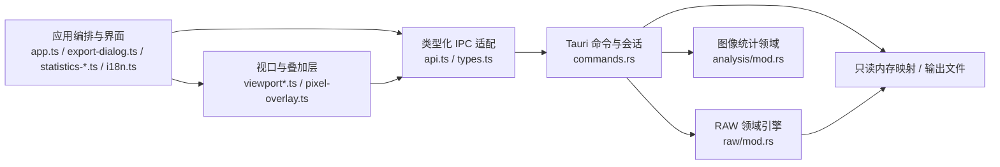

# 系统架构

## 总体分层



前端负责交互、可见瓦片调度和 GPU 合成；Rust 负责文件会话、格式计算、像素读取、处理算法和确定性导出。IPC 只传递结构化请求、文档信息和二进制结果，不传递整幅 RAW 副本。

Tauri capability 采用最小授权：除 `core:default` 外，仅额外授予原生全屏、统计 WebviewWindow、文件对话框和写入图像剪贴板所需权限；F11 直接调用窗口 API，不通过 CSS 模拟或新增 Rust 命令。

## 模块职责

| 模块 | 主要职责 |
| --- | --- |
| `src/app.ts` | 应用状态、参数提交、菜单、状态栏、诊断、设置与对话框编排 |
| `src/app-settings.ts` | 应用设置类型、默认值、旧设置迁移、非法持久值回退和侧栏宽度约束 |
| `src/theme-catalog.ts` | 九套主题的稳定标识、菜单预览元数据、合法性判断和本地化键映射 |
| `src/descriptor-input.ts` | 数值参数的整数化、边界限制和空值默认规则 |
| `src/export-dialog.ts` | 冻结导出快照、范围联动、字段校验和导出反馈 |
| `src/image-capture.ts` / `src/image-output.ts` | 当前画面合成、完整预览瓦片拼接，以及共用的 PNG/剪贴板输出 |
| `src/roi-selection.ts` | 主窗口 ROI 包含式坐标输入校验、右键拖动阈值，以及坐标到矩形的唯一转换规则 |
| `src/statistics-panel.ts` / `src/statistics-window.ts` | 统计纵向总览，以及停靠/独立窗口承载 |
| `src/statistics-chart*.ts` / `src/statistics-report.ts` | 按需加载的主题自适应 ECharts 交互图表，以及暂未接入入口的中性 PNG 报告绘制能力 |
| `src/i18n.ts` | 语言偏好、系统语言解析、七语文案目录、日期时间格式化和静态 DOM 翻译 |
| `src/backend-error.ts` | 解析后端结构化错误码，并在当前语言下生成用户消息 |
| `src/channel-rendering.ts` | 将显示模式与通道渲染偏好映射为纯 GPU 着色参数 |
| `src/missing-pixel-rendering.ts` | 缺失数据外观类型、持久值校验和 GPU 参数转换 |
| `src/viewport.ts` | WebGL2、LOD、瓦片队列、纹理缓存、缩放和平移 |
| `src/viewport-transform.ts` | 屏幕、图像和像素坐标的唯一变换来源；画布尺寸变化时的中心锚定；选区模型 |
| `src/viewport-overlay.ts` | 图像边界 SVG 与独立高对比矩形选区叠加 |
| `src/pixel-overlay.ts` / `src/pixel-value-display.ts` / `src/pixel-grid-rendering.ts` | 高倍率像素网格、颜色校验，以及与当前显示模式一致的原始、单通道或 RGB 数值叠加 |
| `src/api.ts` / `src/types.ts` | Tauri 调用封装及前后端共享数据契约 |
| `src-tauri/src/commands.rs` | 当前文档会话、内存映射、缓存、任务快照和命令边界 |
| `src-tauri/src/raw/mod.rs` | 布局、packing、CFA、预览、Remosaic、Demosaic、检查、RAW 导出与原子输出写入 |
| `src-tauri/src/analysis/mod.rs` | L0 CFA DN 摘要、精确 Histogram、Row/Column Profile 和 QCFA 原子平面 |

`raw/mod.rs` 是无 UI 的领域核心。新格式和算法应优先在这里形成可测试的纯逻辑；`app.ts` 不应承担像素语义。

## 图像统计边界

[图像统计设计](IMAGE_STATISTICS.md)以当前文档、当前帧和 L0 原始 CFA DN 为唯一数据源。独立 Rust `analysis` 领域模块通过内存映射扫描整帧或矩形 ROI；`app.ts` 负责任务编排，`viewport.ts` 只维护与统计窗口无关的主窗口 ROI。

统计任务使用独立 revision，不复用预览 `renderRevision`；IPC 只传递摘要、精确 Histogram、Profile 和溯源元数据，不传递整幅 DN。QCFA 以 4×4 周期内的 16 个原子平面为最小累加单元，R/Gr/Gb/B 是结果层的可验证合并。

停靠区域和独立统计窗口共享唯一 Analysis State 与结构化结果，同一时间只有一个统计视图；摘出或重新停靠只改变呈现载体，不复制任务或重新扫描 RAW。统计视图默认隐藏，通过已打开图像的画布右键菜单进入，首次以底部停靠形式打开并显示 All CFA 总览；独立窗口使用系统原生标题栏，内部不重复绘制标题和关闭按钮。统计通道选择与主窗口预览模式相互独立；面板重建内容时保留自身滚动位置，短暂的无结果加载态不能覆盖已保存位置。

ROI 是主窗口级查看状态，不依赖统计视图是否打开。工具栏入口支持持续右键拖动和包含式起止坐标两种选择方法；短距离右键单击仍由画布菜单处理，拖动可从图像外的画布背景开始并把端点钳制到图像边缘。新 ROI 替换旧 ROI，清除后恢复整帧。选框只在 RAW 强度与 CFA 点阵视图显示，并通过独立 HTML 叠加层和同一图像坐标变换随缩放、平移更新。统计视图打开时，ROI 变化才触发新的分析 revision。

## 国际化与错误契约

- 应用设置保存语言、主题、交互、性能和画面呈现偏好；`system` 会按 BCP 47 语言族解析系统首选语言，不支持的语言回退英文。
- `i18n.ts` 的目录以英文、简体中文、繁体中文、日语、西班牙语、法语和德语形成完整类型约束。模板中的既有文字在创建 DOM 后登记语义键，动态状态直接通过 `t()` 生成。
- 专业格式名、算法名、按键和单位（如 RAW、CFA、Packing、Demosaic、DN、MiB）保持行业惯用写法。
- Rust 命令返回稳定 `code`、插值参数、可选原因和字段名；RAW 布局警告也携带结构化参数。前端不依赖中文后端字符串判断错误类型。
- 运行时诊断保留原始结构化错误，绘制诊断列表和提示时再按当前语言翻译，因此切换语言后已有诊断也会同步更新。

## 文档会话与一致性

Rust 端只维护一个当前文档：

```text
RawDocument
├─ path / name / file_size
├─ Arc<Mmap>                 只读文件映射
├─ RawDescriptor / RawLayout
├─ warnings
└─ generation               文档世代号
```

- 打开文件、关闭文件或提交新描述符会增加 `generation`，并清空预览缓存；关闭文件同时释放只读内存映射。
- 耗时任务先复制不可变快照，再释放文档互斥锁。
- 前端请求携带 `generation`；旧文档结果返回 `stale_generation`。
- 预览另有 `renderRevision`；帧、模式、参数或 LOD 计划变化时，旧任务协作取消并返回 `stale_render`。
- 前端 `inFlight` 记录 revision，旧任务结束时不会误删同键的新任务。
- 导出同时校验来源路径和 `sourceGeneration`，防止对过期配置写文件。
- 完整预览抓拍同时携带文档世代与渲染 revision；帧、显示或处理状态变化后，旧瓦片结果不会被拼入输出。
- 图像统计另有 `analysisRevision`；文件、描述符、frame、ROI 或显式取消发生变化后，旧扫描协作退出并返回 `stale_analysis`。

## 缓存与数据传递

- Rust 使用只读内存映射按需访问 RAW，不复制完整文件。
- Rust 预览缓存保存最近 128 个 RGBA 瓦片。
- 前端纹理缓存按设置提供约 32/64/128 MiB 三档，并按最近使用顺序淘汰。
- 每次最多并发 8 个前端瓦片请求。
- RGBA 瓦片和像素检查结果通过二进制 IPC 返回，避免大型 JSON 数组开销。
- R/G/B 通道瓦片保持后端生成的灰度重建强度；通道颜色由 WebGL 最终合成阶段施加，因此切换偏好不使后端缓存或前端纹理失效。
- 文件内缺失的预览像素以 alpha 254 标记，图像边界外仍使用 alpha 0；WebGL 将标记替换为深色棋盘、浅色棋盘或自定义纯色。外观切换只重绘现有纹理，不重新解码瓦片。

## 故障边界

查看路径允许部分帧、短数据和不合理布局继续尝试；警告进入诊断模型。相同失败瓦片不会无限自动重试，修改参数、帧或模式后才重新尝试。

导出路径采用更严格的边界：

- 前后端都验证范围、位深、packing、对齐和目标兼容性。
- 不允许覆盖当前打开的源文件。
- 先写同目录临时文件，再以可恢复方式替换目标，避免失败时留下半成品。
