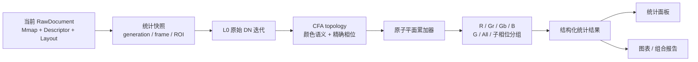
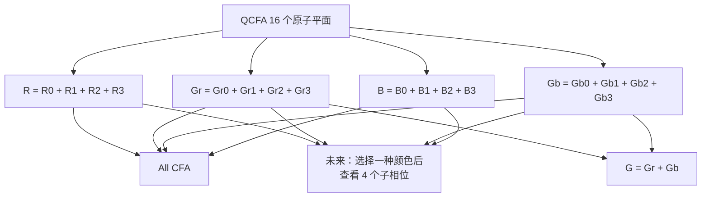
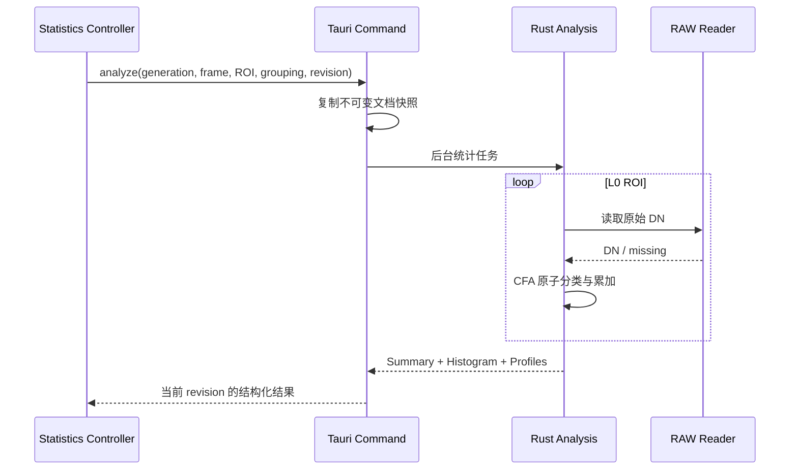
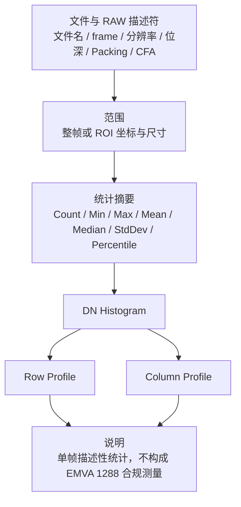

# 图像统计设计

## 文档状态

本文记录 eRAW“图像统计”能力的需求边界、已确认设计和待后续确认的交互细节。该能力尚未实现；本文描述的是实现约束和目标，不代表当前版本已经提供对应入口。

状态约定：

- **已确认**：已形成产品或数据语义共识，后续实现应遵守。
- **建议方案**：当前推荐方向，可以在实现前继续校对。
- **非目标**：明确不纳入 eRAW 图像统计。

## 产品定位

eRAW 仍然是面向 SoC Bring-up 和图像传感器适配的单文件 RAW 查看器。图像统计用于扩展“查看”的专业含义，而不是把软件扩展为多文件测量、图像质量调优或实验室标定平台。

统计定义和图表表达可以参考 EMVA 1288 的严谨性，但单帧描述性统计不等于 EMVA 1288 测量。界面、报告和文档不得把结果标记为 EMVA 1288 compliant，也不得将单帧空间分布解释为 temporal noise、DSNU、PRNU、SNR 或 Dynamic Range。

### 能力边界

| 纳入图像统计 | 非目标 |
| --- | --- |
| 当前单个 RAW 文件 | 多文件测量集和曝光序列配对 |
| 当前选中帧 | 相机、光源、功率计或温箱控制 |
| 整帧或一个矩形 ROI | 光照、辐照度、温度或波长标定 |
| L0 原始 CFA DN | Remosaic/Demosaic 结果统计 |
| 单帧描述性摘要、Histogram、Row/Column Profile | System Gain、QE、正式 SNR、DSNU、PRNU、Dark Current |
| 单图和组合报告的复制、PNG 输出 | EMVA 合规数据表和 Logo |
| 只读计算 | 坏点修复、降噪、校正和其他图像处理 |

文件包含多帧时，统计对象仍然只是当前选中帧；切换帧会产生新的统计快照，不引入跨帧比较。

## 数据语义

### 已确认的数据来源

统计只读取当前文档、当前帧和当前 ROI 对应的 L0 原始 CFA DN：

- 不读取 LOD、RGBA 预览瓦片或 WebGL 结果。
- 不受 RAW/CFA/Remosaic/Demosaic/R/G/B 显示模式影响。
- 不受显示 Min/Max、通道着色、缩放、主题和缺失数据外观影响。
- Remosaic/Demosaic 当前只服务预览；其算法输出不进入统计。
- 对 QCFA，CFA Phase X/Y 必须参与样本分类。
- ROI 使用原图绝对坐标；不得把 ROI 左上角重新当成 CFA 周期原点。
- 文件中无法读取的预期像素计为 missing，不得按 DN 0 参与统计。



统计快照至少冻结：

- 文档 `generation`；
- frame；
- `RawDescriptor` 和 `RawLayout`；
- ROI；
- 统计请求和分组方式。

文档、描述符、frame 或 ROI 变化后，旧任务必须协作失效，不能短暂覆盖新结果。统计任务使用独立的 analysis revision 或 task id，不复用预览 `renderRevision`。

## 区域与样本

### 矩形 ROI

复用现有 `SelectionModel` 和 SVG 叠加层。ROI 继续使用原图坐标和半开区间：

```text
[x, x + width) × [y, y + height)
```

- 没有 ROI 时分析完整当前帧。
- ROI 最小为 1×1。
- 缩放、平移和显示模式切换不改变 ROI。
- 图像尺寸变化时清除 ROI。
- 统计在拖动结束后触发，不在每次 pointer move 上启动完整计算。
- 清除 ROI 后恢复整帧统计。

### 有效与缺失样本

每个统计分组分别记录：

- `expectedCount`：ROI 内理论属于该分组的像素数；
- `validCount`：能够从当前帧读取 DN 的像素数；
- `missingCount`：`expectedCount - validCount`。

Min、Max、Mean、Histogram、Percentile 和 Profile 只使用有效 DN。没有有效 DN 时返回明确的空结果，不能用 0 或 NaN 冒充统计值。

## CFA 与 QCFA 分组

### 原子平面

统计层不应只保留 R/Gr/Gb/B 的合并颜色语义，而应以完整 CFA 周期中的精确位置作为最小计算单元。

```text
标准 Bayer：2×2 周期，4 个原子平面

R   Gr
Gb  B
```

```text
Quad CFA：4×4 周期，16 个原子平面

R0  R1  | Gr0 Gr1
R2  R3  | Gr2 Gr3
--------+--------
Gb0 Gb1 | B0  B1
Gb2 Gb3 | B2  B3
```

推荐的稳定键不是展示标签，而是相对于完整 CFA tile 的精确位置：

```text
CfaPlaneKey
├─ semanticSite    Mono / R / Gr / Gb / B
├─ tileX / tileY   完整 CFA 周期内的位置
└─ subX / subY     同色块内的局部位置
```

描述符中的 `cfaPhaseX/Y` 是源坐标到 `CfaPlaneKey` 的映射参数，不应与结果键中的 tile/sub 坐标混为一谈。

### 分组视图



**已确认的第一版界面边界**：

- MONO 显示 Y。
- Bayer 和 QCFA 默认显示 R、Gr、Gb、B。
- 暂不展示 16 条 QCFA 子相位曲线。

**建议方案**：

- G 和 All CFA 作为可选分组；彩色 CFA 不默认选择 All，避免混合不同颜色响应后产生误导。

**已确认的架构预留**：

- 后端从第一版起保留 QCFA 16 个原子平面的独立累加结果。
- R/Gr/Gb/B 是原子累加器的精确合并，不是读取时丢弃相位后的重新统计。
- 未来的“按子相位查看”只增加分组和界面入口，不修改统计核心、IPC 语义或缓存键。
- 测试使用 4×4 人工 QCFA，每个原子位置写入不同 DN，同时验证 16 平面分类和四颜色合并。

Mean/Variance 使用可合并累加器；Histogram 按 bin 相加。Median、Mode 和 Percentile 必须从合并后的精确 Histogram 计算，不能对各子相位的统计结果做算术平均。

## 统计摘要

### 建议的第一版字段

| 字段 | 口径 |
| --- | --- |
| ROI | 原图绝对坐标、宽、高 |
| Expected / Valid / Missing | 当前分组的预期、有效和缺失样本数 |
| Min / Max DN | 有效样本的最小、最大原始 DN |
| Mean DN | 有效样本算术平均 |
| Median DN | 精确 Histogram 的 50% 分位位置 |
| Mode DN | 最高 bin；并列时结果标记为多峰，不静默选择一个 DN |
| Variance | 当前有限像素集合的总体方差，分母为 `N` |
| Standard Deviation | 总体方差平方根 |
| P1 / P5 / P95 / P99 | 从精确 Histogram 得到的离散 DN 分位数 |
| Zero DN | DN 0 的数量和有效样本占比 |
| Full-scale DN | `2^bitDepth - 1` 的数量和有效样本占比 |

总体方差定义为：

```text
variance = Σ(x - mean)² / N
```

该值描述当前单帧 ROI 中 DN 的空间离散程度，不代表 temporal noise。报告中使用“观测 DN 跨度”描述 `Max - Min`，不得把它命名为 EMVA Dynamic Range。

统计累加应避免大图求和溢出。建议使用可合并的 Welford/Chan 累加器或等价稳定方法，并通过小型已知数组验证 Mean 和 Variance。

## Histogram

### 计算口径

- bin 范围固定为 `0 ... 2^bitDepth - 1`。
- 原始结果保留每个 DN 的精确 count，不因图表宽度改变统计 bin。
- missing 样本不进入任何 bin。
- 每个 CFA 原子平面独立累计；界面所见通道由精确 bin 相加得到。
- 普通、累计、线性纵轴和对数纵轴使用同一份精确 Histogram。
- 对数纵轴中 count 0 作为空点处理，不伪造一个正数。
- 屏幕宽度不足时可以为绘制聚合相邻 bin，但 tooltip、摘要和导出数据仍引用精确结果。

### 建议交互

- 通道开关：Y 或 R/Gr/Gb/B，G、All 可选。
- 普通 Histogram / 累计 Histogram。
- 线性 / 对数纵轴。
- tooltip 显示 DN、count 和占有效样本比例。
- 图中标记 Min、Mean、Median、P1、P99 和 Full-scale DN。
- 支持复制当前图表和保存 PNG。

## Row / Column Profile

Profile 的主要用途是观察单帧中的行列亮度分布、渐变、条带倾向和局部异常；它不是对 row noise、column noise 或固定模式噪声的正式测量。

### 坐标语义

Profile 保留原图物理坐标：

- Row Profile：对 ROI 中每个源图像 `y`，使用当前分组在该行中的有效样本。
- Column Profile：对 ROI 中每个源图像 `x`，使用当前分组在该列中的有效样本。
- CFA 分组在某一物理行或列没有样本时，该坐标返回空点和 count 0；不能补 0，也不改变坐标使曲线看似连续。
- QCFA 子相位模式同样保留源坐标，因此可以与传感器物理行列和画布位置对应。

这是有意选择的稀疏采样表达。将颜色平面压缩成连续坐标虽然图形更平滑，但会失去与 sensor row/column 的直接对应关系，不适合作为默认调试口径。

每个有效 Profile 点至少包含：

```text
coordinate / count / mean / standardDeviation
```

第一版默认绘制 Mean，可切换 Standard Deviation。为了避免四条稀疏 Profile 同时叠加后难以阅读，建议默认一次聚焦一个语义通道，用户再按需叠加其他通道。

## 计算与传输架构

图像统计应使用独立 Rust 领域模块，而不是继续扩大预览和导出职责：

```text
src-tauri/src/analysis/
├─ mod.rs
├─ topology.rs       CFA 原子平面与分组
├─ statistics.rs     可合并摘要累加器
├─ histogram.rs
├─ profile.rs
└─ result.rs         稳定结果契约
```

前端规划：

```text
src/analysis/
├─ types.ts
├─ controller.ts
├─ panel.ts
├─ charts.ts
└─ report.ts
```

约束：

- `app.ts` 只编排入口、快照和结果状态，不计算像素语义。
- `viewport.ts` 只提供 ROI 和坐标，不承担统计。
- `raw/mod.rs` 继续提供 RAW 解码和 CFA 基础语义；统计累加放在独立 `analysis` 模块。
- 整帧 DN 不通过 IPC 传到前端。
- Rust 通过内存映射单次或少量顺序扫描完成统计。
- IPC 只返回摘要、精确 Histogram、Profile 和溯源元数据。
- 大型结果优先使用二进制载荷；结构和标签使用稳定的结构化字段。
- 第一版即使不开放 QCFA 子相位 UI，也要让结果契约能够描述原子平面和分组来源。



## 界面与状态

### 建议方案

- 工具栏提供“图像统计”入口，不在启动时提示。
- 入口打开可折叠、可调整高度的底部面板，不增加浮动工具窗口。
- 底部面板不与可放在左右两侧的参数栏冲突。
- 面板包含“摘要 / Histogram / Row Profile / Column Profile”。
- 没有 ROI 时显示整帧；矩形 ROI 完成后自动重新计算。
- 面板关闭只隐藏结果，不修改 ROI、RAW 参数或当前预览。
- 计算中在面板内部显示进度和取消入口，不使用阻塞提示框。
- 当前实现阶段只维护一份“当前文件、当前帧、当前 ROI”结果，不引入 ImageJ 式多测量历史或跨文件结果表。

面板导致画布尺寸变化时，沿用现有 viewport 中心锚定规则：保持缩放比例，并让原画布中心对应的图像位置继续位于新画布中心。

## 图表与组合报告

目标是减少用户逐个打开图表、截图和手工拼贴 PPT 的工作。

### 第一目标

- 复制单个图表为图片。
- 单个图表另存为 PNG。
- 复制完整统计报告为图片。
- 完整统计报告另存为 PNG。

组合报告使用结构化统计结果重新绘制，不截取软件窗口。建议采用独立于应用主题的中性浅色模板和高分辨率 16:9 版式，以便直接粘贴到常见白底 PPT：



报告必须记录：

- 文件名和 frame；
- RawDescriptor 关键字段；
- ROI；
- 通道分组及其原子平面来源；
- valid/missing 数量；
- 生成时间；
- 单帧统计与非 EMVA 合规声明。

### 后续候选

- 自包含 HTML 报告；
- 精确 Histogram/Profile CSV；
- QCFA 子相位图表；
- 用户可选报告版式。

这些候选不属于第一版承诺，待 PNG/剪贴板工作流投入使用后再根据实际需求决定。

## 与 ImageJ 和 EMVA 1288 的关系

参考 ImageJ：

- ROI 决定分析范围；
- 没有 ROI 时分析整帧；
- 数值摘要、Histogram 和 Profile 分离；
- 图表和结果可以复制、保存。

不复制 ImageJ：

- 多个浮动结果窗口；
- 通用图像处理、粒子分析、宏和插件平台；
- 多次测量历史作为第一版核心工作流。

参考 EMVA 1288：

- 明确 DN、样本、通道和统计公式；
- 区分线性/对数/累计 Histogram；
- 重视水平和垂直 Profile；
- 报告中记录条件、单位和结果来源。

不得借用 EMVA 1288 名称解释单帧无法得到的 temporal 或多图指标。未来若需要完整 EMVA 1288 流程，应设计独立工具，而不是继续扩展 eRAW 的单文档会话。

## 验证责任

实现时至少覆盖：

1. 已知 MONO 小矩阵的 Count、Min、Max、Mean、Variance、Histogram 和 Percentile。
2. 缺失像素从统计中排除，但 expected/valid/missing 一致。
3. 任意 ROI 起点不会重置 Bayer/QCFA phase。
4. 四种 Bayer 排列的 R/Gr/Gb/B 分类。
5. 四种 QCFA 排列、全部 `cfaPhaseX/Y` 组合和 16 个原子平面分类。
6. QCFA 原子 Histogram 合并后与直接 R/Gr/Gb/B 遍历一致。
7. Profile 在无该通道样本的物理行列返回空点，不返回 DN 0。
8. 文档、描述符、frame 或 ROI 变化后旧统计结果失效。
9. 大图计算不复制完整 RAW，不溢出，不阻塞窗口交互。
10. 报告中的摘要和图表与面板当前统计快照一致。
