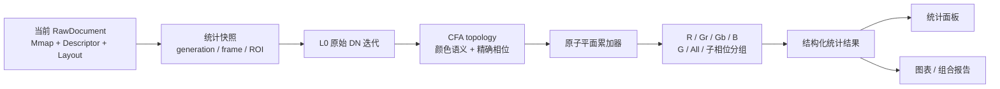
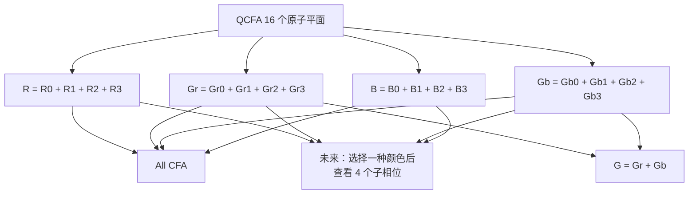
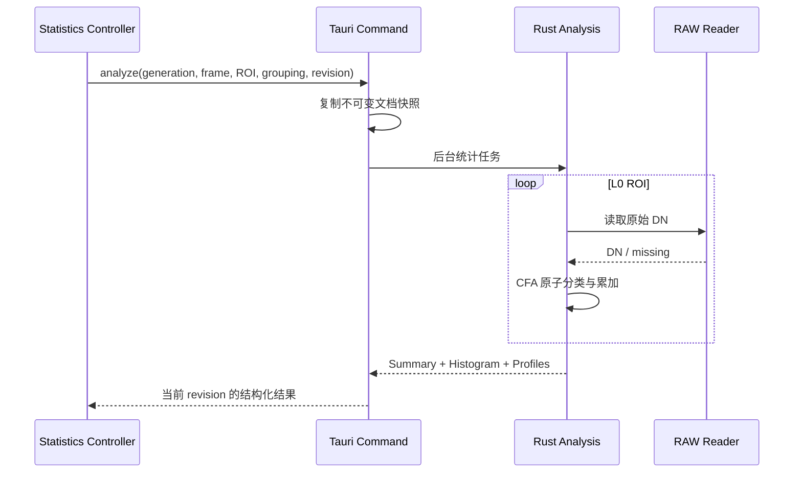
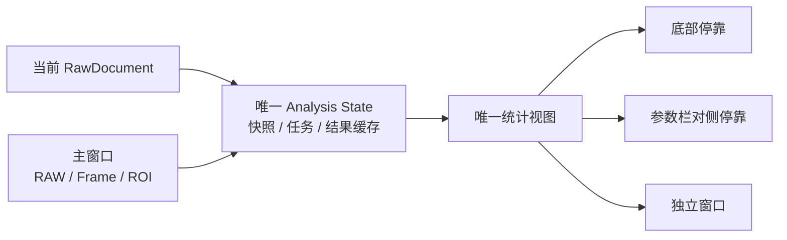
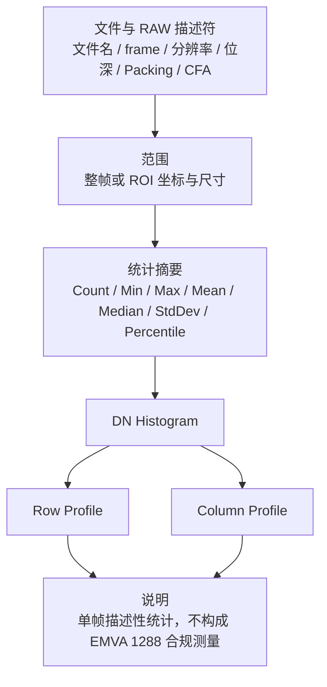

# 图像统计设计

## 文档状态

本文记录 eRAW“图像统计”能力的需求边界、已确认设计和首版实现。V0.3.0 已提供 L0 CFA DN 统计、矩形 ROI、停靠/独立视图、图表与 PNG 报告；后续迭代继续受本文的产品边界约束。

状态约定：

- **已确认**：已形成产品或数据语义共识，后续实现应遵守。
- **建议方案**：当前推荐方向，可以在实现前继续校对。
- **非目标**：明确不纳入 eRAW 图像统计。

## 产品定位

eRAW 仍然是面向 SoC Bring-up 和图像传感器适配的单文件 RAW 查看器。图像统计用于扩展“查看”的专业含义，而不是把软件扩展为多文件测量、图像质量调优或实验室标定平台。

统计定义和图表表达可以参考 EMVA 1288 的严谨性，但单帧描述性统计不等于 EMVA 1288 测量。界面、报告和文档不得把结果标记为 EMVA 1288 compliant，也不得将单帧空间分布解释为 temporal noise、DSNU、PRNU、SNR 或 Dynamic Range。

### 能力边界

| 纳入图像统计 | 非目标 |
| --- | --- |
| 当前单个 RAW 文件 | 多文件测量集和曝光序列配对 |
| 当前选中帧 | 相机、光源、功率计或温箱控制 |
| 整帧或一个矩形 ROI | 光照、辐照度、温度或波长标定 |
| L0 原始 CFA DN | Remosaic/Demosaic 结果统计 |
| 单帧描述性摘要、Histogram、Row/Column Profile | System Gain、QE、正式 SNR、DSNU、PRNU、Dark Current |
| 单图和组合报告的复制、PNG 输出 | EMVA 合规数据表和 Logo |
| 只读计算 | 坏点修复、降噪、校正和其他图像处理 |

文件包含多帧时，统计对象仍然只是当前选中帧；切换帧会产生新的统计快照，不引入跨帧比较。

## 数据语义

### 已确认的数据来源

统计只读取当前文档、当前帧和当前 ROI 对应的 L0 原始 CFA DN：

- 不读取 LOD、RGBA 预览瓦片或 WebGL 结果。
- 不受 RAW/CFA/Remosaic/Demosaic/R/G/B 显示模式影响。
- 不受显示 Min/Max、通道着色、缩放、主题和缺失数据外观影响。
- Remosaic/Demosaic 当前只服务预览；其算法输出不进入统计。
- 对 QCFA，CFA Phase X/Y 必须参与样本分类。
- ROI 使用原图绝对坐标；不得把 ROI 左上角重新当成 CFA 周期原点。
- 文件中无法读取的预期像素计为 missing，不得按 DN 0 参与统计。



统计快照至少冻结：

- 文档 `generation`；
- frame；
- `RawDescriptor` 和 `RawLayout`；
- ROI；
- 统计请求和分组方式。

文档、描述符、frame 或 ROI 变化后，旧任务必须协作失效，不能短暂覆盖新结果。统计任务使用独立的 analysis revision 或 task id，不复用预览 `renderRevision`。

## 区域与样本

### 矩形 ROI

ROI 是主窗口级状态，复用 `SelectionModel` 和独立高对比 HTML 叠加层，不由统计窗口创建或销毁。内部矩形继续使用原图坐标和半开区间：

```text
[x, x + width) × [y, y + height)
```

- 没有 ROI 时分析完整当前帧。
- ROI 最小为 1×1。
- 缩放、平移和显示模式切换不改变 ROI。
- 坐标输入使用包含端点的 `X[a,b] Y[c,d]`，前端转换为 `x=a, width=b-a+1` 和 `y=c, height=d-c+1`；不静默交换、裁剪或取整非法输入。
- 坐标原点是源图像左上角 `(0, 0)`。
- ROI 选框只在 RAW 强度和 CFA 点阵视图显示；切换到其他显示模式只隐藏边框，不删除 ROI。
- 图像尺寸变化时清除 ROI。
- 启用鼠标框选后保持该模式，用户可连续使用右键拖动替换 ROI；左键仍用于画面平移。
- 右键移动超过屏幕阈值后才开始框选；未超过阈值的右键单击继续打开画布菜单，完成拖动后抑制同一次菜单事件。
- 鼠标可从图像外的画布背景开始或结束拖动，图像坐标统一钳制到合法边缘。
- 统计在拖动结束后触发，不在每次 pointer move 上启动完整计算。
- 清除 ROI 后恢复整帧统计。

### 有效与缺失样本

每个统计分组分别记录：

- `expectedCount`：ROI 内理论属于该分组的像素数；
- `validCount`：能够从当前帧读取 DN 的像素数；
- `missingCount`：`expectedCount - validCount`。

Min、Max、Mean、Histogram、Percentile 和 Profile 只使用有效 DN。没有有效 DN 时返回明确的空结果，不能用 0 或 NaN 冒充统计值。

## CFA 与 QCFA 分组

### 原子平面

统计层不应只保留 R/Gr/Gb/B 的合并颜色语义，而应以完整 CFA 周期中的精确位置作为最小计算单元。

```text
标准 Bayer：2×2 周期，4 个原子平面

R   Gr
Gb  B
```

```text
Quad CFA：4×4 周期，16 个原子平面

R0  R1  | Gr0 Gr1
R2  R3  | Gr2 Gr3
--------+--------
Gb0 Gb1 | B0  B1
Gb2 Gb3 | B2  B3
```

推荐的稳定键不是展示标签，而是相对于完整 CFA tile 的精确位置：

```text
CfaPlaneKey
├─ semanticSite    Mono / R / Gr / Gb / B
├─ tileX / tileY   完整 CFA 周期内的位置
└─ subX / subY     同色块内的局部位置
```

描述符中的 `cfaPhaseX/Y` 是源坐标到 `CfaPlaneKey` 的映射参数，不应与结果键中的 tile/sub 坐标混为一谈。

### 分组视图



**已确认的第一版界面边界**：

- MONO 的总体入口显示 Y。
- Bayer 和 QCFA 默认进入 All CFA 总览，用户再按层级查看子通道。
- 通道层级为 `All CFA → R / G / B`，G 下继续区分 Gr/Gb。
- QCFA 的 R、Gr、Gb、B 未来可以继续展开四个原子子相位。
- 暂不展示 16 条 QCFA 子相位曲线。

All CFA 不只是一条合并曲线，而是总体统计与子通道比较的入口：

- 摘要使用全部有效 CFA 站点。
- Histogram 以 All CFA 为主，同时默认叠加较细的 R/Gr/Gb/B 子通道曲线。
- Profile 默认只绘制 All CFA，避免稀疏子通道曲线同时叠加；用户可主动添加子通道。
- 进入 G 时可以同时比较 G、Gr、Gb；进入其他语义通道时聚焦该通道。
- All CFA 的 Mean、Median 和 Histogram 混合了不同颜色响应，界面应明确标注为“All CFA 站点”，不能解释成单一光谱通道。

**已确认的架构预留**：

- 后端从第一版起保留 QCFA 16 个原子平面的独立累加结果。
- R/Gr/Gb/B 是原子累加器的精确合并，不是读取时丢弃相位后的重新统计。
- 未来的“按子相位查看”只增加分组和界面入口，不修改统计核心、IPC 语义或缓存键。
- 测试使用 4×4 人工 QCFA，每个原子位置写入不同 DN，同时验证 16 平面分类和四颜色合并。

Mean/Variance 使用可合并累加器；Histogram 按 bin 相加。Median、Mode 和 Percentile 必须从合并后的精确 Histogram 计算，不能对各子相位的统计结果做算术平均。

## 统计摘要

### 建议的第一版字段

| 字段 | 口径 |
| --- | --- |
| ROI | 原图绝对坐标、宽、高 |
| Expected / Valid / Missing | 当前分组的预期、有效和缺失样本数 |
| Min / Max DN | 有效样本的最小、最大原始 DN |
| Mean DN | 有效样本算术平均 |
| Median DN | 精确 Histogram 的 50% 分位位置 |
| Mode DN | 最高 bin；并列时结果标记为多峰，不静默选择一个 DN |
| Variance | 当前有限像素集合的总体方差，分母为 `N` |
| Standard Deviation | 总体方差平方根 |
| P1 / P5 / P95 / P99 | 从精确 Histogram 得到的离散 DN 分位数 |
| Zero DN | DN 0 的数量和有效样本占比 |
| Full-scale DN | `2^bitDepth - 1` 的数量和有效样本占比 |

总体方差定义为：

```text
variance = Σ(x - mean)² / N
```

该值描述当前单帧 ROI 中 DN 的空间离散程度，不代表 temporal noise。报告中使用“观测 DN 跨度”描述 `Max - Min`，不得把它命名为 EMVA Dynamic Range。

统计累加应避免大图求和溢出。建议使用可合并的 Welford/Chan 累加器或等价稳定方法，并通过小型已知数组验证 Mean 和 Variance。

## Histogram

### 计算口径

- bin 范围固定为 `0 ... 2^bitDepth - 1`。
- 原始结果保留每个 DN 的精确 count，不因图表宽度改变统计 bin。
- missing 样本不进入任何 bin。
- 每个 CFA 原子平面独立累计；界面所见通道由精确 bin 相加得到。
- 普通、累计、线性纵轴和对数纵轴使用同一份精确 Histogram。
- 对数纵轴中 count 0 作为空点处理，不伪造一个正数。
- 屏幕宽度不足时可以为绘制聚合相邻 bin，但 tooltip、摘要和导出数据仍引用精确结果。

### 建议交互

- MONO 默认显示 Y；彩色 CFA 默认显示 All CFA，并叠加 R/Gr/Gb/B 子通道比较。
- 通道选择使用 `All CFA → R / G / B → Gr / Gb` 的层级；QCFA 原子子相位保留为未来的更深层级。
- 普通 Histogram / 累计 Histogram。
- 线性 / 对数纵轴。
- tooltip 显示 DN、count 和占有效样本比例。
- 图中标记 Min、Mean、Median、P1、P99 和 Full-scale DN。
- 支持复制当前图表和保存 PNG。

## Row / Column Profile

Profile 的主要用途是观察单帧中的行列亮度分布、渐变、条带倾向和局部异常；它不是对 row noise、column noise 或固定模式噪声的正式测量。

### 坐标语义

Profile 保留原图物理坐标：

- Row Profile：对 ROI 中每个源图像 `y`，使用当前分组在该行中的有效样本。
- Column Profile：对 ROI 中每个源图像 `x`，使用当前分组在该列中的有效样本。
- CFA 分组在某一物理行或列没有样本时，该坐标返回空点和 count 0；不能补 0，也不改变坐标使曲线看似连续。
- QCFA 子相位模式同样保留源坐标，因此可以与传感器物理行列和画布位置对应。

这是有意选择的稀疏采样表达。将颜色平面压缩成连续坐标虽然图形更平滑，但会失去与 sensor row/column 的直接对应关系，不适合作为默认调试口径。

每个有效 Profile 点至少包含：

```text
coordinate / count / mean / standardDeviation
```

第一版默认绘制 All CFA 的 Mean，可切换 Standard Deviation。子通道 Profile 由用户主动叠加；进入某个通道层级后以该通道为主，避免四条稀疏 Profile 在总览中同时出现。

## 计算与传输架构

图像统计应使用独立 Rust 领域模块，而不是继续扩大预览和导出职责：

```text
src-tauri/src/analysis/
├─ mod.rs
├─ topology.rs       CFA 原子平面与分组
├─ statistics.rs     可合并摘要累加器
├─ histogram.rs
├─ profile.rs
└─ result.rs         稳定结果契约
```

前端规划：

```text
src/analysis/
├─ types.ts
├─ controller.ts
├─ panel.ts
├─ charts.ts
└─ report.ts
```

约束：

- `app.ts` 只编排入口、快照和结果状态，不计算像素语义。
- `viewport.ts` 只提供 ROI 和坐标，不承担统计。
- `raw/mod.rs` 继续提供 RAW 解码和 CFA 基础语义；统计累加放在独立 `analysis` 模块。
- 整帧 DN 不通过 IPC 传到前端。
- Rust 通过内存映射单次或少量顺序扫描完成统计。
- IPC 只返回摘要、精确 Histogram、Profile 和溯源元数据。
- 大型结果优先使用二进制载荷；结构和标签使用稳定的结构化字段。
- 第一版即使不开放 QCFA 子相位 UI，也要让结果契约能够描述原子平面和分组来源。



## 界面与状态

### 已确认的呈现方式

- 默认窗口不显示统计按钮、细栏或面板，保持 RAW 查看画布整洁。
- 打开图像后，画布右键菜单在四项抓拍操作上方增加“图像统计…”并使用分隔线区分分析与输出；未打开图像时仍不可进入。
- “图像统计…”只负责打开、展开或聚焦唯一统计视图，不根据右键位置推断 ROI，也不创建第二个实例。
- 统计视图只有一个实例，可以停靠在主窗口底部、停靠在参数栏对侧，也可以“摘出”为独立窗口；三种形态不同时维护多份结果。
- 第一次进入或没有已保存偏好时以主窗口底部停靠形式打开，保持功能启用后的高内聚形态；用户显式切换底部/侧方停靠或摘出后记住该呈现偏好。
- 停靠视图提供“摘出”入口，独立窗口提供“停靠到主窗口”入口；切换呈现方式不重新计算。
- 独立窗口使用 Windows 原生标题栏和关闭按钮，窗口内容不重复绘制标题栏或关闭图标；停靠视图保留文字形式的关闭入口。
- 统计视图已打开时，画布右键入口展开停靠区域或聚焦独立窗口。
- 停靠视图可在底部与参数栏对侧之间切换；底部可调整高度，侧方可调整宽度。窗口宽度不足时禁用侧方入口，不自动收起参数栏。
- 统计视图不分页，按 ROI 信息、数据完整性、DN 直方图与摘要、行剖面、列剖面的顺序纵向排列；各板块以主题对比色分隔线区分。
- 没有 ROI 时显示整帧；矩形 ROI 完成后自动重新计算。
- 关闭统计视图只隐藏统计结果，不修改 ROI 数据、ROI 边框、RAW 参数或当前预览。
- 计算中在统计视图内部显示进度和取消入口，不使用阻塞提示框。
- 当前实现阶段只维护一份“当前文件、当前帧、当前 ROI”结果，不引入 ImageJ 式多测量历史或跨文件结果表。
- 每个图表独立选择显示曲线或操作坐标范围，不改变其他图表，也不改变主窗口 RAW/CFA/Remosaic/Demosaic 预览模式。
- 独立窗口跟随主窗口的当前文件、描述符、frame 和 ROI；关闭文件后保持窗口但进入空状态。
- 停靠与独立形态使用一致的纵向总览，不增加页面层级。

停靠区域导致画布尺寸变化时，沿用现有 viewport 中心锚定规则：保持缩放比例，并让原画布中心对应的图像位置继续位于新画布中心。

```text
打开 RAW
→ 画布右键
→ 图像统计…
→ 默认查看当前 ROI 或整帧的 All CFA 总览
→ 按需在主工具栏选择或更新 ROI
→ 按需摘出统计窗口
```



### ROI 操作

主工具栏在“适应窗口”左侧提供两个互斥的 ROI 一级按钮，并用分隔线与右侧视图按钮区分：

```text
[鼠标框选 ROI] [坐标 ROI] | [适应窗口]
       R          Shift+R
```

- 没有 ROI 时默认统计完整当前帧。
- 鼠标按钮启用后保持选中，可连续使用右键按下位置和松开位置形成新的包含式 ROI；左键继续平移图像。
- 坐标方式在前端校验整数、顺序与图像边界，合法后一次性替换 ROI。
- 已有 ROI 时，任一方式完成的新 ROI 都替换旧 ROI。
- 两个按钮互斥；点击当前选中的按钮即清除 ROI 并取消选中状态，不显示额外的小型关闭按钮。
- 清除 ROI 后恢复整帧；不存在“保留 ROI 但统计整帧”的第二套范围状态。
- `Esc` 只取消正在进行的框选，不删除此前已经完成的 ROI。
- 同尺寸 frame 切换继续保留 ROI；图像尺寸变化时清除。
- 统计视图关闭、停靠或摘出都不改变 ROI；选框在 RAW 强度和 CFA 点阵视图中始终显示。
- 右键菜单入口不增加“统计此处”等位置相关语义；统计始终使用当前主窗口 ROI，没有 ROI 时使用整帧。

### 一键重置

统计视图工具栏在底部、侧方和独立三种形态下都提供“重置视图”操作。该操作无数据破坏性，直接执行而不弹确认框。

重置后的默认展示状态：

- 三个图表都显示全部可用语义曲线；MONO 只显示 Y。
- 横纵轴恢复自动范围，横轴输入框恢复当前完整数据域。
- 摘要继续使用 All CFA；MONO 使用 Y。
- 当前呈现布局中的三个图表高度恢复该布局默认值，其他布局的用户高度保持不变。
- 页面回到顶部。

“重置视图”不得：

- 清除或修改 ROI；
- 切换 frame；
- 修改 RAW 描述符；
- 改变主窗口预览模式；
- 重新打开或关闭文件；
- 强制改变当前停靠/独立形态或窗口位置。

如果默认展示需要的原子统计已经缓存，重置只重新组合和绘制结果；不能无条件重新扫描 RAW。

## 图表与组合报告

目标是减少用户逐个打开图表、截图和手工拼贴 PPT 的工作。

### 当前图表控件

- DN 直方图、行剖面和列剖面由 Apache ECharts 绘制，不使用固定白底 Canvas 图片。
- 图表背景透明，坐标轴、文字、网格和 Tooltip 读取当前主题变量；深浅主题切换后重新应用主题。
- 每个图表同时绘制全部可用语义通道，并分别提供曲线显隐开关；All 与 G 通过线宽和虚线与其他曲线区分，颜色明暗从当前主题变量派生。隐藏曲线不参与 Tooltip。
- Tooltip 和十字指示器用于读取坐标与数值；图表在事件捕获阶段放行无修饰键滚轮，普通滚轮用于滚动纵向统计页面，`Ctrl + 滚轮`、图内拖动和底部范围滑块用于缩放及平移横轴范围。
- 横轴滑块两端提供起止坐标输入。输入越过另一端时，另一端重置到完整数据域的对应边界；输入值始终钳制到合法范围。
- 右侧纵轴滑块提供纵向缩放和平移，每个图表可单独重置 Y 轴。
- 直方图横轴在 0 DN 与满量程 DN 外保留少量显示边距，避免饱和尖峰与图框重叠；输入范围和统计数据域仍使用真实 DN 边界。
- 图表之间的分隔线可上下拖动，分别调整三个图表的高度；双击恢复当前布局默认高度。该分隔线不额外引入键盘操作。
- 图表范围交互只改变统计视图，不反向修改 ROI。
- 曲线、横纵范围和底部/侧方/独立布局的图表高度持久化。ROI、加载态和新统计结果更新时保留当前纵向浏览位置；“重置视图”将曲线、图表范围、当前布局高度和页面位置恢复到默认状态。
- 精确 Histogram 保留在结构化结果中；屏幕绘制最多聚合为 4096 个显示桶，摘要仍使用精确结果。

### 暂缓的组合报告

- 当前统计窗口不提供报告按钮、报告预览、单图复制或单图保存入口，先集中验证信息展示与交互图表。
- `statistics-report.ts` 保留独立于界面主题的结构化 16:9 PNG 绘制代码，但不接入保存流程。
- 后续恢复报告能力时，仍采用“一键选择路径后直接生成”的小入口，不增加分页或排版编辑器。

组合报告使用结构化统计结果重新绘制，不截取软件窗口。采用独立于应用主题的中性浅色模板和高分辨率 16:9 版式，以便直接插入常见白底 PPT：



报告必须记录：

- 文件名和 frame；
- RawDescriptor 关键字段；
- ROI；
- 通道分组及其原子平面来源；
- valid/missing 数量；
- 生成时间；
- 单帧统计与非 EMVA 合规声明。

全部 CFA 采样点的默认报告同时包含总体摘要和子通道比较：DN 直方图显示全部 CFA 采样点与 R/Gr/Gb/B，摘要对照区列出各语义通道的均值、标准差、零值 DN 和满量程 DN；行列剖面默认保持全部 CFA 采样点，避免报告被稀疏曲线淹没。

### 后续候选

- 自包含 HTML 报告；
- 精确 Histogram/Profile CSV；
- QCFA 子相位图表；
- 用户可选报告版式。

这些候选不属于第一版承诺，待 PNG 报告工作流投入使用后再根据实际需求决定。

## 与 ImageJ 和 EMVA 1288 的关系

参考 ImageJ：

- ROI 决定分析范围；
- 没有 ROI 时分析整帧；
- 数值摘要、Histogram 和 Profile 分离；
- 图表和结果可以复制、保存。

不复制 ImageJ：

- 多个浮动结果窗口；
- 通用图像处理、粒子分析、宏和插件平台；
- 多次测量历史作为第一版核心工作流。

参考 EMVA 1288：

- 明确 DN、样本、通道和统计公式；
- 区分线性/对数/累计 Histogram；
- 重视水平和垂直 Profile；
- 报告中记录条件、单位和结果来源。

不得借用 EMVA 1288 名称解释单帧无法得到的 temporal 或多图指标。未来若需要完整 EMVA 1288 流程，应设计独立工具，而不是继续扩展 eRAW 的单文档会话。

## 验证责任

实现时至少覆盖：

1. 已知 MONO 小矩阵的 Count、Min、Max、Mean、Variance、Histogram 和 Percentile。
2. 缺失像素从统计中排除，但 expected/valid/missing 一致。
3. 任意 ROI 起点不会重置 Bayer/QCFA phase。
4. 四种 Bayer 排列的 R/Gr/Gb/B 分类。
5. 四种 QCFA 排列、全部 `cfaPhaseX/Y` 组合和 16 个原子平面分类。
6. QCFA 原子 Histogram 合并后与直接 R/Gr/Gb/B 遍历一致。
7. Profile 在无该通道样本的物理行列返回空点，不返回 DN 0。
8. 文档、描述符、frame 或 ROI 变化后旧统计结果失效。
9. 大图计算不复制完整 RAW，不溢出，不阻塞窗口交互。
10. 恢复报告入口后，报告中的摘要和图表必须与面板当前统计快照一致。

## V0.3.0 首版实现说明

- `src-tauri/src/analysis/mod.rs` 负责 L0 DN 扫描、稳定矩统计、精确 Histogram、Profile 和 QCFA 原子平面。
- `analysisRevision` 与文档 `generation` 共同阻止旧结果覆盖新文件、frame 或 ROI。
- V0.3.3 将统计视图收敛为单页总览，并完成统计标签和报告文字的七语本地化。
- V0.3.4 将 ROI 提升为主窗口独立能力，支持鼠标与包含式坐标选择；选区使用固定三像素高对比虚线和明暗阴影，并只在 RAW 强度/CFA 点阵视图显示。
- V0.3.4 将统计视图改为纵向板块，使用 Apache ECharts 提供主题自适应的 Tooltip、十字指示器、拖动缩放和范围滑块；报告入口暂时移除，绘制代码保留。
- V0.3.5 将 ROI 改为可连续使用的右键拖动模式，支持从图像外画布开始并钳制到图像边缘；独立 HTML 叠加层确保深浅主题下边框可靠可见，右键单击仍打开菜单。
- V0.3.5 将图表滚轮缩放限定为 `Ctrl + 滚轮`，普通滚轮保留给纵向统计页面。
- V0.3.6 在 ECharts 事件处理之前放行普通滚轮，并跨 ROI 加载与结果更新保存统计面板的纵向浏览位置。
- V0.4.0 将鼠标框选与坐标 ROI 拆为互斥一级按钮，增加 ROI、像素定位、缩放、统计和抓拍快捷键；首次及连续右键框选都保持高对比边框可见。
- V0.4.0 增加参数栏对侧停靠、三个图表的独立曲线显隐、主题相关线条、横纵轴缩放、横轴范围输入及可拖动图表高度，并持久化不同呈现布局的视图状态。
- `src/statistics-window.ts` 只承载同一份结构化结果；摘出或重新停靠不会重新扫描 RAW。
- 首版 IPC 返回 All/Y 或 All/R/G/Gr/Gb/B 的精确 Histogram 与 Profile，以及原子平面摘要；未来展开 QCFA 子相位时不改变统计内核。
- HTML、CSV、统计历史、多 ROI 和多文件测量仍属于后续候选或明确非目标。
