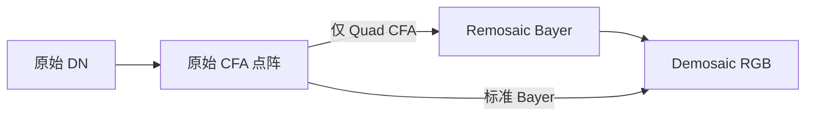

# RAW 格式与导出语义

## 描述符

| 字段 | 语义 |
| --- | --- |
| `width` / `height` | 每帧有效像素尺寸；前端限制为 `1–100000` |
| `bitDepth` | 有效 DN 位深；Unpacked16 支持 8–16 bit，其余 packing 使用固定位深 |
| `packing` | 像素在文件中的存储方式 |
| `endianness` | Unpacked16 容器的大小端 |
| `bitAlignment` | Unpacked16 容器中的有效位位于 LSB 或 MSB；16 bit 时两者等价 |
| `cfa` | MONO、四种标准 Bayer 或四种 Quad CFA |
| `cfaPhaseX/Y` | Quad CFA 相位偏移，范围 0–3 |
| `rowAlignment` / `rowStride` | 行对齐或显式行字节步长 |
| `frameAlignment` / `frameStride` | 帧对齐或显式帧字节步长 |
| `headerOffset` | 第一帧相对文件起点的字节偏移 |

对齐值和步长都以字节为单位。显式步长为 0 时：

```text
rowBytes   = packing 所需的最小有效行字节数
rowStride  = align_up(rowBytes, rowAlignment)
frameBytes = rowStride × height
frameStride = align_up(frameBytes, frameAlignment)
```

## 存储方式

| Packing | 位深约束 | 组织方式 |
| --- | --- | --- |
| Unpacked8 | 8 bit | 每像素 1 字节 |
| Unpacked16 | 8–16 bit | 每像素 2 字节；支持奇数位深、大小端和 LSB/MSB |
| MIPI RAW10 | 10 bit | 4 像素 / 5 字节 |
| MIPI RAW12 | 12 bit | 2 像素 / 3 字节 |
| MIPI RAW14 | 14 bit | 4 像素 / 7 字节 |

MIPI packing 不是任意连续位流 packing，不能用单一 `packed` 布尔值替代具体格式。

主界面先选择 packing：Unpacked8 与 MIPI RAW10/12/14 会锁定对应位深，并隐藏不参与解码的字节序和有效位位置；Unpacked16 允许选择 8–16 bit，16 bit 时隐藏无实际作用的有效位位置。

## CFA 与处理链

标准 Bayer 为 `RGGB/BGGR/GBRG/GRBG`；Quad CFA 为对应的 `QRGGB/QBGGR/QGBRG/QGRBG`，原始周期为 4×4、每种颜色形成 2×2 同色块。



Remosaic 只负责重排或同色站点重建，不包含颜色校正。预览归一化和 CFA 着色不会修改源 DN。

## 多帧与不完整数据

帧数由文件有效字节数和 `frameStride` 推导，没有独立的固定帧数上限。最后一段不足完整帧时仍作为可尝试的部分帧显示，并产生诊断警告。

读取失败的像素在预览中使用缺失数据纹理表达；查看不会因为单个异常参数立即拒绝整个文档。

## 导出

导出只处理当前帧和所选矩形，不负责批量多帧转换。

| 目标 | 输出语义 |
| --- | --- |
| 原始 CFA | 单通道 RAW；支持裁剪、padding 移除、packing、位深、端序和对齐转换 |
| Remosaic | 单通道标准 Bayer；仅 Quad CFA；使用当前 Remosaic 选项 |
| Demosaic | RGB48 Interleaved；每通道 16-bit，端序可选 |

数值映射支持：

- `Preserve`：保持 DN，超过目标位深时裁剪并统计数量。
- `ScaleFullRange`：从源满量程线性映射到目标满量程。

缺失像素填充值属于最终输出 DN，不再经过上述映射。MONO 使用一个值；彩色 CFA 使用独立的 R、Gb、Gr、B 值。Demosaic 缺失像素使用 R、B 和两个绿色填充值的平均。

裁剪会更新输出 CFA 语义：

- 标准 Bayer 根据裁剪起点切换排列。
- Quad CFA 保持阵列类型并更新 0–3 相位。
- Remosaic 输出报告裁剪后的标准 Bayer。
- Demosaic 输出不再具有 CFA。
