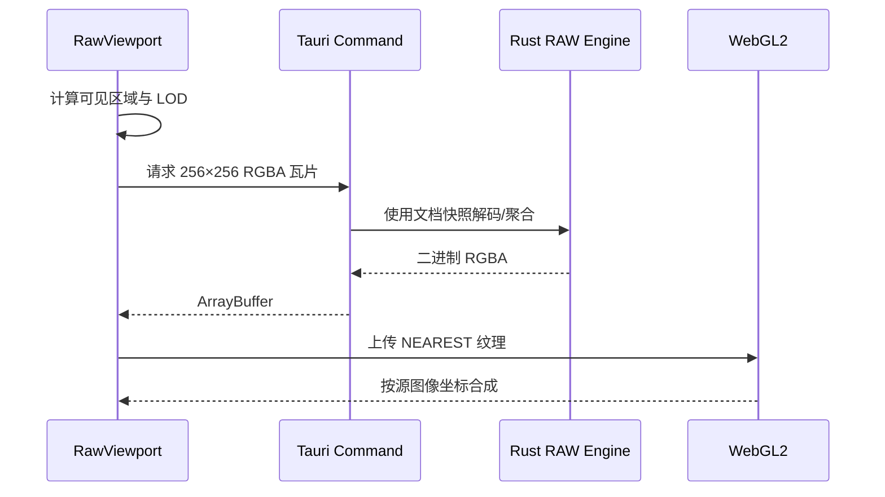

# 预览与交互架构

## 瓦片管线



- L0 一个纹素对应一个源像素。
- L1 及以上一个纹素覆盖 `2^L × 2^L` 的源区域。
- 瓦片固定为 256×256 RGBA；边缘超出图像的部分保持透明。
- WebGL2 使用全局图像坐标和整数 `texelFetch` 选择瓦片纹素；100% 视图将相机对齐实际帧缓冲像素，避免瓦片边缘落在像素中心并触发栅格化相位错位。
- 纹理使用最近邻过滤，确保高倍率像素格清晰。
- R/G/B 单通道瓦片携带灰度重建强度；WebGL 根据设置使用 `[1,0,0]`、`[0,1,0]`、`[0,0,1]` 或 `[1,1,1]` 完成最终着色。切换无需重算瓦片，非灰度的缺失数据棋盘保持原诊断颜色。

## 两类 LOD 语义

| 模式 | 聚合方式 | 层级过渡 |
| --- | --- | --- |
| 彩色 CFA 的 RAW 强度 | 同 CFA 站点 DN 平均，以灰度显示 | 单一结构层级 + 迟滞 |
| CFA 点阵 | 同站点平均，只点亮对应 R/G/B 通道 | 单一结构层级 + 迟滞 |
| Remosaic | 按处理后的标准 Bayer 站点平均 | 单一结构层级 + 迟滞 |
| MONO RAW | 覆盖区域普通平均 | 相邻层级平滑混合 |
| Demosaic / RGB 通道 | 覆盖区域按通道平均 | 相邻层级平滑混合 |

结构预览不能混合两套不同尺度的 CFA 网格，否则 L2 以上会趋近 Demosaic 的平滑效果。Quad CFA 在 L1 将一个原生 2×2 同色块归并为一个标准 Bayer 站点；更高层继续按站点聚合，而不是跨 R/G/B 混色。

极度缩小时无法真实呈现每个源像素。此时显示的是“保留阵列结构的局部统计预览”，不是对单个源像素的伪装。

## 相机与坐标

`ViewportTransform` 是所有坐标换算的唯一来源：

```text
screen = camera + image × zoom
image  = (screen - camera) / zoom
pixel  = floor(image)
```

- 缩放范围由适应窗口比例的 8%（最低 0.0005×）至 64×。
- 滚轮和手动输入均为连续缩放；LOD 只是后台采样层级。
- 滚轮缩放固定指针下的图像位置。
- 适应窗口被限制为 100%、手动切换实际像素，以及窗口或全屏尺寸变化后仍为 100% 时，相机都会重新对齐物理像素；最多移动半个物理像素。
- 图像允许自由拖动，但始终至少保留一部分在视口中。

## 叠加层

- 十字准星按当前像素中心绘制，状态栏坐标随指针更新。
- 坐标定位会切换到 64×并将目标像素置于画布中央。
- 高倍率像素值使用独立 Canvas 2D；只有像素格能完整容纳数值时才启用。
- RAW/CFA 显示源 DN，Remosaic 显示处理后的 Bayer DN；R/G/B 显示对应的重建通道 DN，不受彩色或灰度着色偏好影响；Demosaic 可显示源 DN 或三行插值 RGB。
- 数字颜色根据像素亮度自动反色，并保留像素格边界。
- 像素检查一次最多请求 65536 个像素，并缓存可见区域外 3 像素保护带。

内部矩形选区保存在原图坐标中，使用半开区间 `[x, x + width) × [y, y + height)`。缩放、平移、模式切换和同尺寸帧切换不会改变选区；图像尺寸变化时清除。当前 UI 尚未开放区域选择入口。

## 任务失效与观测

可见瓦片优先按离视口中心的距离排序。状态栏显示当前 LOD、已加载瓦片和始终可见的 loading 数量，并提供最近、平均和最慢瓦片耗时；计时每个瓦片只读取两次 `performance.now()`，不是性能基准。

过期任务协作取消，失败瓦片在当前 revision 内停止重试，避免不完整帧或错误参数造成无限错误循环。
