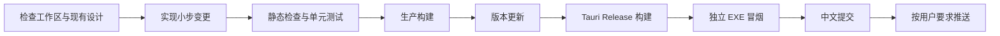

# 迭代、版本与发布流程

## 需求进入实现前

每轮迭代先判断：

- 是否符合“RAW 查看与传感器调试工具”的产品定位。
- 是否会让预览容错和导出严格性相互污染。
- 是否造成状态来源重复、跨层耦合或不可取消的耗时任务。
- 是否属于低频信息，应使用菜单、弹窗或覆盖层而非常驻占位。
- 是否可以通过人工验证显著降低无意义的自动化成本。

如果需求会改变产品边界、数据语义或架构依赖，应先讨论并形成明确决策再实现。

## Git 策略

- `master` 保持可构建、可测试。
- 大功能在 `codex/<feature>` 分支实现，回归通过后合并回 `master`。
- 提交按可解释的功能粒度拆分，提交信息使用中文。
- 版本更新通常独立成提交，便于区分功能实现与发布快照。
- 不修改或提交来源不明的用户文件；当前 `TODO.lss` 明确保留为未跟踪文件。
- 默认只提交本地；只有用户明确要求时才推送远端。

## 版本策略

开发版本从 V0.0.1 开始：

- 小修复和局部优化增加补丁号。
- 较大特性或架构能力增加次版本号。
- 只有功能范围明确完整、测试通过并准备公开发布时，才转为 V1.0.0。

版本必须同步更新：

- `package.json` 与 `package-lock.json`
- `src-tauri/Cargo.toml` 与 `Cargo.lock`
- `src-tauri/tauri.conf.json`
- `src/app.ts`
- README 与必要的工程文档

## 一次完整迭代



推荐命令：

```powershell
git status --short
npm.cmd run check
npm.cmd run build
cargo test --manifest-path src-tauri/Cargo.toml
npm.cmd run release
```

不要用裸 `cargo build --release` 代替发布命令；它不会保证执行 Tauri 的前端构建和资源嵌入流程。

## 发布验收

发布前至少确认：

- `git diff --check` 无格式错误。
- TypeScript 检查、前端构建和全部 Rust 测试通过。
- Release EXE 能作为独立程序启动，不依赖 Vite 开发服务器。
- 关于页版本与构建时间正确。
- 没有把测试 RAW、`target/`、`dist/` 或用户临时文件纳入提交。
- 人工回归范围与本次风险相匹配。

推送后比较 `HEAD` 与 `origin/master`；提交差异必须为 `0 / 0`。网络异常时停止强行绕过，由用户恢复网络或手动推送后再核对。
