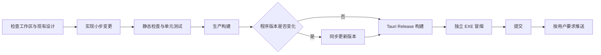

# 迭代、版本与发布流程

## 需求进入实现前

每轮迭代先判断：

- 是否符合“RAW 查看与传感器调试工具”的产品定位。
- 是否会让预览容错和导出严格性相互污染。
- 是否造成状态来源重复、跨层耦合或不可取消的耗时任务。
- 是否属于低频信息，应使用菜单、弹窗或覆盖层而非常驻占位。
- 是否可以通过人工验证显著降低无意义的自动化成本。

如果需求会改变产品边界、数据语义或架构依赖，应先讨论并形成明确决策再实现。

## Git 策略

- `master` 保持可构建、可测试。
- 大功能在 `codex/<feature>` 分支实现，回归通过后合并回 `master`。
- 每轮迭代按可解释、可验证的功能粒度形成一个或多个提交，提交信息使用中文。
- 同一功能直接关联的实现、测试和文档放在同一责任边界内；相互独立的变更分开提交，不按文件数量机械拆分或合并。
- 版本更新通常独立成提交，便于区分功能实现与发布快照。
- 不修改或提交来源不明的用户文件；发现未跟踪文件时先确认其归属。
- 默认只提交本地；只有用户明确要求时才推送远端。

## 版本策略

版本号使用 `主版本.子版本.迭代版本` 三段格式，并按本轮最高级别的变更更新一次：

- 在用户明确说明主版本变更前，主版本号保持不变；不得仅因功能积累或准备发布而自动提升主版本号。
- 重大功能变更、特性变更或重大交互方式变更提升子版本号，并将迭代版本归零。
- 普通功能迭代、缺陷修复和局部优化提升最后一位迭代版本号。
- 仅修改 README 且不改变程序代码时，不提升版本号。
- 同一轮包含多类变更时，按其中级别最高的变更决定版本号。

版本必须同步更新：

- `package.json` 与 `package-lock.json`
- `src-tauri/Cargo.toml` 与 `Cargo.lock`
- `src-tauri/tauri.conf.json`
- `src/app.ts`
- 必要的工程文档；README 不展示软件版本号

## 一次完整迭代



推荐命令：

```powershell
git status --short
npm.cmd run check
npm.cmd run test:frontend
npm.cmd run build
cargo test --manifest-path src-tauri/Cargo.toml
npm.cmd run release
```

自动化测试流程不得加入 `npm.cmd run dev`、`npm.cmd run tauri dev` 或其他常驻服务启动命令。交互或视觉检查应使用已构建的 Release EXE，并为启动、探测和关闭设置明确的时间边界。

不要用裸 `cargo build --release` 代替发布命令；它不会保证执行 Tauri 的前端构建和资源嵌入流程。

## GitHub 自动化

- `.github/workflows/ci.yml` 在 `master` 推送、面向 `master` 的 Pull Request 和手动触发时运行前后端检查、测试与生产构建。
- 发布标签使用 `Vx.y.z` 格式，并且必须与仓库中的软件版本严格一致。
- 推送发布标签后，`.github/workflows/release.yml` 自动运行完整检查和 Tauri Release 构建，创建对应的 GitHub Release。
- Windows x64 成果物固定命名为 `eRAW-Vx.y.z-windows-x64.exe`。
- 普通提交和未推送的本地标签不会创建 GitHub Release。

## 发布验收

发布前至少确认：

- `git diff --check` 无格式错误。
- TypeScript 检查、国际化测试、前端构建和全部 Rust 测试通过。
- Release EXE 能作为独立程序启动，不依赖 Vite 开发服务器。
- 关于页版本与构建时间正确。
- 没有把测试 RAW、`target/`、`dist/` 或用户临时文件纳入提交。
- 人工回归范围与本次风险相匹配。

推送后比较 `HEAD` 与 `origin/master`；提交差异必须为 `0 / 0`。网络异常时停止强行绕过，由用户恢复网络或手动推送后再核对。

## 翻译目录维护

- 新增或修改用户可见文字时，同步补齐 `src/i18n.ts` 的七种语言，不提交空白占位。
- 产品名、RAW/CFA/Packing/Remosaic/Demosaic、格式名、单位和按键保持行业惯用写法；普通说明文字应完整翻译。
- 带变量的消息只通过命名占位符传入数值，不拼接后端自然语言。
- 后端新增用户可见错误或警告时，先定义稳定代码和结构化参数，再在前端目录中映射；不要以任一语言的句子作为控制流条件。
- 变更目录或系统语言解析后运行 `npm.cmd run test:i18n`，并至少在最小窗口尺寸检查英文和一种长文本语言。
